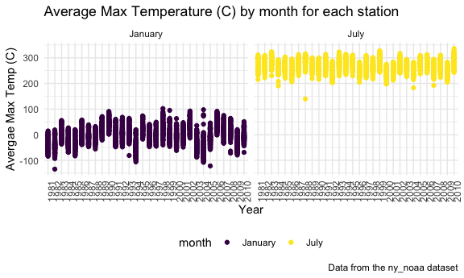

p8105_hw3_maf2311
================
Mackenzie Frost
Octobr 8 2022

# Problem 1

``` r
library(p8105.datasets)
data("instacart")
aisles = instacart %>%
  group_by(aisle) %>%
  summarize(n_obs = n())
max = max(aisles$n_obs)
max_aisle = filter(aisles, aisles$n_obs == max)
```

Instacarts Dataset Description:

The Instacart Dataset has the following variables: order_id, product_id,
add_to_cart_order, reordered, user_id, eval_set, order_number,
order_dow, order_hour_of_day, days_since_prior_order, product_name,
aisle_id, department_id, aisle, department. It has 1384617 rows and 15
columns. For example, a user with the user ID of 112108 ordered
Bulgarian Yogurt from the dairy eggs department on the 4th day of the
week.

There are 134 unique aisles, and the most items are ordered from the
aisle ‘fresh vegetables’ with 150609 items.

Make a plot that shows the number of items ordered in each aisle,
limiting this to aisles with more than 10000 items ordered. Arrange
aisles sensibly, and organize your plot so others can read it:

``` r
aisles %>%
  filter(n_obs > 10000) %>%
  ggplot(aes(x = aisle, y = n_obs)) + 
  geom_point() +
  labs(
    title = "Number of Items by aisle",
    x = "Aisle name",
    y = "Number of Items",
    caption = "Data from the instacart dataset"
  ) +
  theme(axis.text.x = element_text(angle=90, hjust=1))
```


Make a table showing the three most popular items in each of the aisles
“baking ingredients”, “dog food care”, and “packaged vegetables fruits”.
Include the number of times each item is ordered in your table.

``` r
new = 
instacart %>%
  filter(aisle == "baking ingredients" | aisle == "dog food care" | aisle == "packaged vegetables fruits") %>%
  group_by(aisle, product_name) %>%
  summarize(n_obs = n()) %>%
  arrange(desc(n_obs)) %>%
  slice(1:3)
```

    ## `summarise()` has grouped output by 'aisle'. You can override using the
    ## `.groups` argument.

``` r
new
```

    ## # A tibble: 9 × 3
    ## # Groups:   aisle [3]
    ##   aisle                      product_name                                  n_obs
    ##   <chr>                      <chr>                                         <int>
    ## 1 baking ingredients         Light Brown Sugar                               499
    ## 2 baking ingredients         Pure Baking Soda                                387
    ## 3 baking ingredients         Cane Sugar                                      336
    ## 4 dog food care              Snack Sticks Chicken & Rice Recipe Dog Treats    30
    ## 5 dog food care              Organix Chicken & Brown Rice Recipe              28
    ## 6 dog food care              Small Dog Biscuits                               26
    ## 7 packaged vegetables fruits Organic Baby Spinach                           9784
    ## 8 packaged vegetables fruits Organic Raspberries                            5546
    ## 9 packaged vegetables fruits Organic Blueberries                            4966

Make a table showing the mean hour of the day at which Pink Lady Apples
and Coffee Ice Cream are ordered on each day of the week; format this
table for human readers (i.e. produce a 2 x 7 table).

``` r
apples_icecream = instacart %>% 
  filter(product_name == "Pink Lady Apples" | product_name == "Coffee Ice Cream") %>%
  group_by(product_name, order_dow) %>%
  summarize(mean_hour = mean(order_hour_of_day)) %>%
  rename(Day=order_dow) %>%
  pivot_wider(
    names_from = "Day", 
    values_from = "mean_hour"
  )
```

    ## `summarise()` has grouped output by 'product_name'. You can override using the
    ## `.groups` argument.

``` r
apples_icecream
```

    ## # A tibble: 2 × 8
    ## # Groups:   product_name [2]
    ##   product_name       `0`   `1`   `2`   `3`   `4`   `5`   `6`
    ##   <chr>            <dbl> <dbl> <dbl> <dbl> <dbl> <dbl> <dbl>
    ## 1 Coffee Ice Cream  13.8  14.3  15.4  15.3  15.2  12.3  13.8
    ## 2 Pink Lady Apples  13.4  11.4  11.7  14.2  11.6  12.8  11.9

# Problem 2

``` r
accel = read_csv(file = "./local_data_q1_q2/accel_data.csv") %>% 
  janitor::clean_names() %>%
    pivot_longer(
    activity_1:activity_1440,
    names_to = "activity_minute", 
    values_to = "activity") %>%
  mutate(SatSun = ifelse(day == "Saturday" | day == "Sunday", 1, 0))
```

    ## Rows: 35 Columns: 1443
    ## ── Column specification ────────────────────────────────────────────────────────
    ## Delimiter: ","
    ## chr    (1): day
    ## dbl (1442): week, day_id, activity.1, activity.2, activity.3, activity.4, ac...
    ## 
    ## ℹ Use `spec()` to retrieve the full column specification for this data.
    ## ℹ Specify the column types or set `show_col_types = FALSE` to quiet this message.

The accel dataset contains five weeks of accelerometer data collected on
a 63 year-old male with BMI 25, who was admitted to the Advanced Cardiac
Care Center of Columbia University Medical Center and diagnosed with
congestive heart failure (CHF). It has 50400 rows and 6 columns, and the
variables included: week, day_id, day, activity_minute, activity, SatSun

Traditional analyses of accelerometer data focus on the total activity
over the day. Using your tidied dataset, aggregate across minutes to
create a total activity variable for each day, and create a table
showing these totals. Are any trends apparent?

``` r
summ_table = accel %>% 
  group_by(day_id) %>%
  summarize(total_day_activity = sum(activity))

accel = accel %>% 
  group_by(day_id) %>%
  mutate(
    total_day_activity = sum(activity)
    )

summ_table
```

    ## # A tibble: 35 × 2
    ##    day_id total_day_activity
    ##     <dbl>              <dbl>
    ##  1      1            480543.
    ##  2      2             78828.
    ##  3      3            376254 
    ##  4      4            631105 
    ##  5      5            355924.
    ##  6      6            307094.
    ##  7      7            340115.
    ##  8      8            568839 
    ##  9      9            295431 
    ## 10     10            607175 
    ## # … with 25 more rows

The last two Sunday’s of the measurement period, the participant had
significantly lower activity throughout the day, compared to the other
days.

Accelerometer data allows the inspection activity over the course of the
day. Make a single-panel plot that shows the 24-hour activity time
courses for each day and use color to indicate day of the week. Describe
in words any patterns or conclusions you can make based on this graph.

``` r
ggplot(accel, aes(x = activity_minute, y = activity, color = day))  + 
  geom_line() +
  labs(
    title = "Activity by Day",
    x = "Activity over 24 hours",
    y = "Accelerometer activity level",
    caption = "Data from the accel dataset"
  ) +
  theme(axis.text.x=element_blank(),
        axis.ticks.x=element_blank())
```


Across the five weeks, it appears that Wednesdays (yellow) are the
participant’s least active days, and the participant is the most active
in the early morning, and least active just before noon.

# Problem 3

``` r
library(p8105.datasets)
data("ny_noaa")
missing = sum(is.na(ny_noaa))
total_cells = ncol(ny_noaa) * nrow(ny_noaa)
pct_missing = (missing / total_cells) * 100
```

The NOAA dataset contains data from NOAA National Climatic Data Center.
For each Weather station ID, the dataset describes the Date of
observation, Precipitation (tenths of mm), Snowfall (mm), Snow depth
(mm), Maximum temperature (tenths of degrees C), and the Minimum
temperature (tenths of degrees C). It has 2595176 rows and 7 columns.
18.6479122% of the data is missing.

Do some data cleaning. Create separate variables for year, month, and
day. Ensure observations for temperature, precipitation, and snowfall
are given in reasonable units. For snowfall, what are the most commonly
observed values? Why?

``` r
ny_noaa = ny_noaa %>%
  janitor::clean_names() %>%
  separate(col = date, into = c('year', 'month', 'day'), sep = '-')
skimr::skim(ny_noaa)
```

|                                                  |         |
|:-------------------------------------------------|:--------|
| Name                                             | ny_noaa |
| Number of rows                                   | 2595176 |
| Number of columns                                | 9       |
| \_\_\_\_\_\_\_\_\_\_\_\_\_\_\_\_\_\_\_\_\_\_\_   |         |
| Column type frequency:                           |         |
| character                                        | 6       |
| numeric                                          | 3       |
| \_\_\_\_\_\_\_\_\_\_\_\_\_\_\_\_\_\_\_\_\_\_\_\_ |         |
| Group variables                                  | None    |

Data summary

**Variable type: character**

| skim_variable | n_missing | complete_rate | min | max | empty | n_unique | whitespace |
|:--------------|----------:|--------------:|----:|----:|------:|---------:|-----------:|
| id            |         0 |          1.00 |  11 |  11 |     0 |      747 |          0 |
| year          |         0 |          1.00 |   4 |   4 |     0 |       30 |          0 |
| month         |         0 |          1.00 |   2 |   2 |     0 |       12 |          0 |
| day           |         0 |          1.00 |   2 |   2 |     0 |       31 |          0 |
| tmax          |   1134358 |          0.56 |   1 |   4 |     0 |      532 |          0 |
| tmin          |   1134420 |          0.56 |   1 |   4 |     0 |      548 |          0 |

**Variable type: numeric**

| skim_variable | n_missing | complete_rate |  mean |     sd |  p0 | p25 | p50 | p75 |  p100 | hist  |
|:--------------|----------:|--------------:|------:|-------:|----:|----:|----:|----:|------:|:------|
| prcp          |    145838 |          0.94 | 29.82 |  78.18 |   0 |   0 |   0 |  23 | 22860 | ▇▁▁▁▁ |
| snow          |    381221 |          0.85 |  4.99 |  27.22 | -13 |   0 |   0 |   0 | 10160 | ▇▁▁▁▁ |
| snwd          |    591786 |          0.77 | 37.31 | 113.54 |   0 |   0 |   0 |   0 |  9195 | ▇▁▁▁▁ |

``` r
snowfall = ny_noaa %>%
  group_by(snow) %>%
  summarize(n_obs = n()) %>%
  arrange(desc(n_obs))
```

The most commonly observed values are 0 mm, NA, and 25 mm
(respectively). Since the most reported variable is 0 mm,we can assume
that among stations that collect snowfall data, the mojority of data
collections indicate no snowfall.

Make a two-panel plot showing the average max temperature in January and
in July in each station across years. Is there any observable /
interpretable structure? Any outliers?

``` r
JanJuly = ny_noaa %>%
  filter((month == "01" | month == "07") & tmax != "") %>%
  mutate(month = ifelse(month == "01", "January", "July")) %>%
  group_by(id, year, month) %>%
  summarize(
    tmax = mean(as.integer(tmax))
  )
```

    ## `summarise()` has grouped output by 'id', 'year'. You can override using the
    ## `.groups` argument.

``` r
ggplot(JanJuly, aes(x = year, y = tmax, color = month)) + 
  geom_point() + 
  facet_grid(. ~ month) +
  labs(
    title = "Average Max Temperature (C) by month for each station",
    x = "Year",
    y = "Avergae Max Temp (C)",
    caption = "Data from the ny_noaa dataset"
  )  +
  theme(axis.text.x = element_text(angle=90, hjust=1))
```



The stations record a range of values for the maximum temperature each
year, and there are several outliers. There seems to be a larger spread
of recorded temperatures in January, comapred to July.

Make a two-panel plot showing:

1)  tmax vs tmin for the full dataset (note that a scatterplot may not
    be the best option)

2)  make a plot showing the distribution of snowfall values greater than
    0 and less than 100 separately by year.

``` r
tmax_tmin = ny_noaa %>%
  ggplot(aes(x = as.integer(tmax), y = as.integer(tmin))) + 
  geom_hex() +
  labs(
    x = "Max Tempterature (C)",
    y = "Min Tempterature (C)",
    caption = "Data from the ny_noaa dataset"
  )

snowfallGraph = ny_noaa %>%
  filter(snow > 0 & snow < 100) %>%
  ggplot(aes(x = tmax, y = year)) + 
  geom_density_ridges(scale = .85)
  labs(
    title = "Snowfall by year",
    x = "Snowfall (mm)",
    y = "Count",
    caption = "Data from the ny_noaa dataset"
  ) + theme(axis.text.x = element_text(angle=90, hjust=1))
```

    ## NULL

``` r
tmax_tmin 
```

    ## Warning: Removed 1136276 rows containing non-finite values (stat_binhex).


``` r
snowfallGraph
```

    ## Picking joint bandwidth of 29.3


